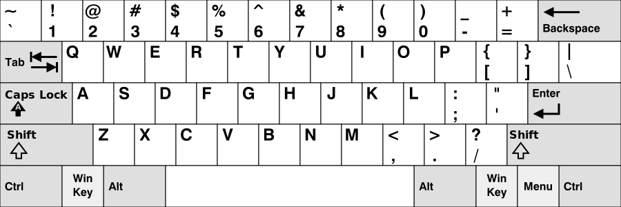
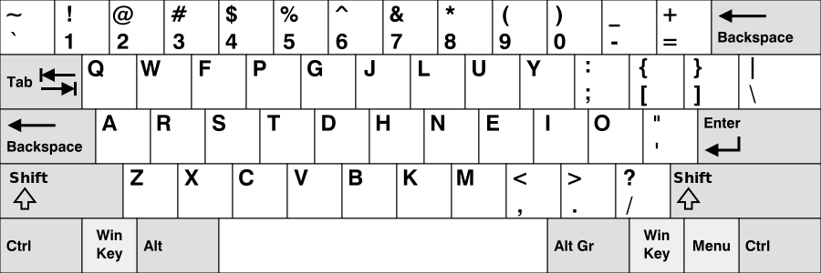
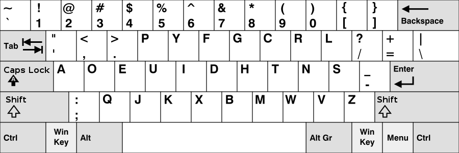

# Produktivität als Programmierer
Da wir Programmierer lösungs- und optimierungsorientierte Menschen sind befinden wir uns stetig auf der Suche nach einer Möglichkeit noch mehr aus uns herauszuholen. 
Aus einem Zitat von *Elon Musk* :
> "It's mostly about the bandwidth, the speed of the connection between your brain and the digital version of yourself, particularly output." 

wird klar dass viele Menschen sich mit diesen Problemen beschäftigen.
Die [Lösung](https://de.wikipedia.org/wiki/Neuralink) die *Musk* anstrebt ist zwar noch 'Zukunftsmusik' aber wir können versuchen unseren Output zu steigern indem wir unsere Tools effizienter nutzen, nachfolgend werde ich auf verschiedene Möglichkeiten eingehen.

## Vim 
### Was ist Vim?
Vim ist ein Editor und stellt einen Clone des *vi*-Editors dar, der Name steht für "*Vi iMproved*".
Vim ist ein modaler Editor, d.h., der Editor unterscheidet zwischen verschiedenen Modi:
- *Normal*
- *Insert*
- *Visual*

Diese Modi gruppieren die verschiedenen Operationen.
#### Normal Mode
In diesem Modus wird durch das Dokument navigiert. Durch die ca. 700 Kommandos ist die Maus theoretisch nicht mehr von Nöten! Aber keine Angst du musst nicht alle beherrschen um klar zu kommen. Bereits mit einer kleinen Untergruppe der Befehle bist du in der Lage dich effizient durch ein Dokument zu bewegen. Unter [Vim Shortcuts](#vim-shortcuts) kannst du diese einsehen.

Anfänglich ist ist es recht überwältigend sich zurecht zu finden in der Vim-Welt, aber sie es als Investition! 
Schnell lernst du das du du keine Pfeiltasten benötigst um den Cursor zu navigieren, wir nutzen einfach <kbd>h</kbd><kbd>j</kbd><kbd>k</kbd><kbd>l</kbd>, verrückt oder?  Es ist auch möglich nach Worten, Sätzen, Zeilen, Bildschirm- oder sogar Dokumentbereichen zu navigieren. So kannst du schnell ans Ende oder den Anfang einer Zeile Springen, du kannst Vim auffordern den Cursor im Bildschirm ganz oben, in der Mitte oder ganz Unten zu platzieren.
### Installation
Vim kannst du [hier](https://www.vim.org/download.php) herunterladen.

Wir werden außerdem Vim als [Plugin](#vim-plugin) in *Eclipse* installieren und somit auch dort in den Genuss seiner Features kommen.
### Konfiguration
[TODO: vimrc]
#### Vim Shortcuts
Hier habe ich ein kleines [cheatsheet](./source/downloads/cheatsheet_vim.pdf) zusammen gestellt, dieses darfst du dir gerne herunterladen.

## IDE
### Eclipse
#### Vim-plugin
### Eclipse Shortcuts

## Tastatur
### Zehnfingersystem
Um den größtmöglichen Vorteil aus unseren mächtigen Tools zu ziehen ist es von Vorteil nicht mehr auf die Tastatur sehen zu müssen und uns somit auf unsere Arbeit konzentrieren zu können! Da wir, dank [vim](#vim), nicht einmal mehr die Maus benötigen geschweige denn die Pfeiltasten können wir all unsere Arbeiten von der Grundstellung <kbd>a</kbd><kbd>s</kbd><kbd>d</kbd><kbd>f</kbd> und <kbd>j</kbd><kbd>k</kbd><kbd>l</kbd><kbd>ö</kbd> aus erledigen! Wenn wir nun daran arbeiten sicher im [Zehnfingersystem](https://de.wikipedia.org/wiki/Zehnfingersystem) zu werden profitieren wir und unsere Arbeit von den Synergien die sich daraus ergeben!

Folgende Seiten empfehle ich hierfür:
- [typingclub](https://www.typingclub.com/)
- [tipp10](https://online.tipp10.com/de)
- [typeracer](https://play.typeracer.com/)

### Tastatur-Layouts
Es gibt die verschiedensten Tastaturbelegungen, um einige zu nenen:

#### QWERTY

Diese Tastatur ist am weitesten verbreitet und wird im englischsprachigen Raum verwendet.

#### QWERTY

Bild layout unser Layout das wir kennen und 'lieben?'.
Meiner Meinung nach ist diese Tastaturbelegung teilweise recht umstänndlich zehnfingertippend zu programmieren. So ist zum Beispiel die geschweifte Klammer '{' recht umständlich über <kbd>Alt Gr</kbd>+<kbd>7</kbd> oder über <kbd>strg</kbd><kbd>alt</kbd>+<kbd>7</kbd> zu tippen.

#### Colemak

Ist optimiert auf moderne Bedürfnisse und eignet sich besonders für gängige Tastenkürzel. Die Lage der Grundstellung wurde so gewählt um häufige Phrasen schneller tippen zu können.

#### Dvorak

Soll besonders ergonomisch sein und eignet sich besonders zum Programmieren!
Solltest du dich entscheiden *dvorak* einen Versuch zu widmen kannst du dies ebenfalls bei [typingclub](https://www.typingclub.com/dvorak) tun!

## Sonstige Software
### Autohotkey
Solltest dein [Tastatur Layout](#tastatur-layouts) nicht anpassen wollen oder du traust dich noch nicht diesen Schritt zu gehen dann kannst du die Belegung deiner Tastatur auch umgehen mit Tools wie *Autohotkey*. Ich habe hier die Navigation von Vim implementiert und lege die Belegung der geschweiften und eckigen Klammern um. 

#### Installation
Lade dir [AutoHotkey](https://autohotkey.com/) herunter.
Anschließend erstellst du ein `autohotkey.ahk`-Skript. 

#### Skripte
*AutoHotkey* kommt mit einer eigenen mächtigen Skriptsprache diese wird interpretiert und ermöglicht Vielerlei!

Mein Skript sieht wie folgt aus:
```script
!h::Send,{Left}
!l::Send,{Right}
!k::Send,{Up}
!j::Send,{Down}
!b::Send,{[}
!n::Send,{]}
!v::Send,{{}
!m::Send,{}}
```
AutoHotkey kann noch viel mehr, ich nutze derzeitig aber nur dieses Feature.
[Hier](https://autohotkey.com/docs/Scripts.htm) findest du weitere Informationen.


